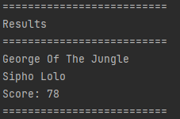
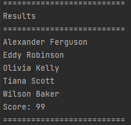

# python-top-score-csv-parser
 An example script to pull the top scores from a CSV file using Python

## Requirements
``
Python 3.2+
``
## Usage guide
```
$ cd /path/to/repo/

Unsorted results
================
$ python3 main.py --filename data/TestData.csv
$ python3 main.py --filename data/600_row_test.csv
$ python3 main.py --filename data/600_row_column_reordering_test.csv


Sorted results
================
$ python3 main.py --filename data/TestData.csv --sorting alphabetical
$ python3 main.py --filename data/600_row_test.csv --sorting alphabetical
$ python3 main.py --filename data/600_row_column_reordering_test.csv --sorting alphabetical
```

## Notes
1. Required columns on the CSV are "First Name", "Second Name", "Score"
2. Order of columns doesn't matter since data ordering is pulled from the header order
3. There are 3 example data files stored at 
<br>``data/TestData.csv``
<br>``data/600_row_test.csv``
<br>``data/600_row_column_reordering_test.csv``

## Screenshots

